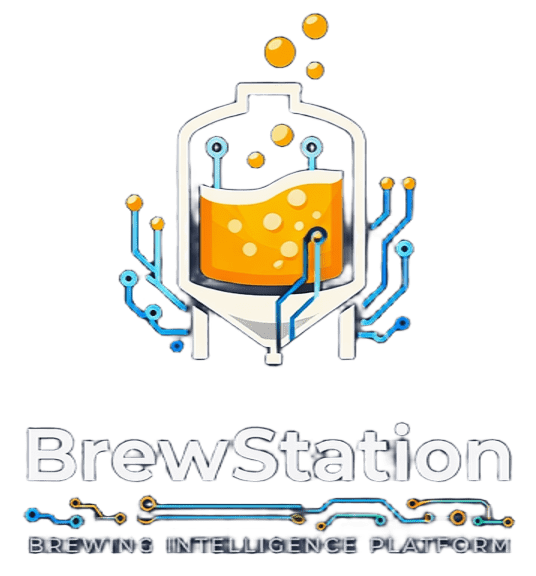

# BrewStation 🍺

Plataforma web modular para controle de brassagens artesanais, classificação de ingredientes, precificação, estoque e relatórios – construída com Flask, SQLAlchemy e integração nativa com o BrewFather.

## Índice

- [Visão Geral](#visão-geral)
- [Funcionalidades Principais](#funcionalidades-principais)
- [Instalação com Docker](#instalação-com-docker)
  - [Debian / Ubuntu (Produção)](#debian--ubuntu-produção)
  - [Windows (Desenvolvimento)](#windows-desenvolvimento)
- [Instalação Bare-Metal (Debian)](#instalação-bare-metal-debian)
- [Atualização](#atualização)
- [Backup](#backup)
- [Documentação Completa](#documentação-completa)
- [Variáveis de Ambiente Essenciais](#variáveis-de-ambiente-essenciais)
- [Estrutura de Pastas](#estrutura-de-pastas)
- [Integração com o BrewFather](#integração-com-o-brewfather)
- [Sistema de Plugins](#sistema-de-plugins)

## Visão Geral

- **Público-alvo**: cervejarias artesanais, laboratórios de testes e homebrewers avançados.
- **Pilares**: catálogo de insumos, cálculo de custos, sincronização BrewFather, rastreabilidade de envase, notificações e painéis operacionais.
- **Stack**: Python 3.11+, Flask 3, SQLAlchemy 2, PostgreSQL, Flask-Login, Flask-Mail, Pandas/OpenPyXL para importação/exportação.
- **Arquitetura**: Sistema modular com plugins extensíveis para adicionar funcionalidades dinamicamente.

## Funcionalidades Principais

### Catálogo e precificação
- CRUD completo de maltes, lúpulos e leveduras, com importação via planilhas-modelo (`/upload/modelo/<tipo>`).
- Criação de receitas locais ou a partir de sincronizações BrewFather.
- Motor de cálculo configurável (margens, impostos, custo de envase, sanitização, taxa de cartão).
- Relatórios consolidados com preço sugerido, custo por litro e margens previstas.

### Estoque, envase e custos
- Movimentações (entrada/saída/ajuste) com custo médio e alerta por estoque mínimo.
- Módulo de envase vinculado a lotes do BrewFather, incluindo embalagens, SKUs e quantidades produzidas.
- Cálculo de custo de produção (ingredientes + embalagens + operacionais) e sugestão de preço final.

### Operação e monitoramento
- Dashboard com indicadores de produção, notificações e status das integrações.
- Sistema de notificações com filtros (todas/lidas/não lidas/lixeira) e ações rápidas.
- Perfil de usuário completo (dados pessoais, redes sociais, preferências de alertas, troca de senha).

### Integrações
- **BrewFather**: sincronização de receitas, lotes e inventário, com cadastro automático dos insumos faltantes.
- **E-mail (SMTP)**: envio de notificações administrativas e workflow de solicitações de acesso.
- **Uploads/Relatórios**: importação e exportação em Excel com ajustes automáticos de layout.

### Sistema de Plugins
- Arquitetura modular extensível
- Gerador de plugins template (`flask plugin create`)
- Instalação e ativação dinâmica de plugins
- Menu de navegação hierárquico configurável por plugin
- Templates e rotas isolados por plugin
- CLI completo para gerenciamento de plugins

---

## Instalação com Docker

### Pré-requisitos

- **Docker** e **Docker Compose** (plugin `docker compose` ou `docker-compose`)
- **Git**

#### Debian / Ubuntu

```bash
# Instalar Docker
curl -fsSL https://get.docker.com | sh
sudo usermod -aG docker $USER
# Faça logout e login novamente para o grupo docker surtir efeito

# Instalar Docker Compose plugin
sudo apt install docker-compose-plugin
```

#### Windows

1. Instale [Docker Desktop para Windows](https://docs.docker.com/desktop/setup/install/windows-install/)
2. Certifique-se de que o WSL2 está habilitado ( Docker Desktop > Settings > General > "Use WSL 2 based engine")
3. Clone o projeto em um diretório no filesystem do Linux (WSL) para melhor performance:

```powershell
# Recomendado: clonar dentro do WSL
wsl
cd ~
git clone https://github.com/ChristopherNicolasSMM/BrewStation.git
cd BrewStation

# Alternativa (mais lenta): direto no Windows
git clone https://github.com/ChristopherNicolasSMM/BrewStation.git
cd BrewStation
```

---

### Configuração Inicial

1. **Configure o arquivo `.env`** na raiz do projeto:

```bash
cp src/config.env.modelo .env
```

Edite o `.env` com suas configurações. O mínimo necessário para rodar:

```env
SECRET_KEY=uma-chave-segura-aqui
FLASK_ENV=PRD
DEBUG=False
NEON_DATABASE=brewstation
NEON_USER=brewstation
NEON_PASSWORD=escolha-uma-senha
```

> O banco PostgreSQL será criado automaticamente na primeira execução com as credenciais acima.

2. **Suba os serviços:**

```bash
# Subir o stack completo (app + postgres + nginx)
docker compose up -d

# Acompanhar os logs
docker compose logs -f app

# Verificar o status
docker compose ps
```

3. **Acesse:** `http://localhost` (nginx porta 80)

   Login padrão: **admin** / **123** (troque a senha no primeiro login)

---

### Debian / Ubuntu (Produção)

Para ambiente de produção com domínio e SSL:

```bash
# Clonar o repositório
sudo git clone https://github.com/ChristopherNicolasSMM/BrewStation.git /opt/brewstation
cd /opt/brewstation

# Configurar .env
sudo cp src/config.env.modelo .env
sudo nano .env  # ajuste SECRET_KEY, NEON_PASSWORD, etc.

# Subir o stack
docker compose up -d

# Em outro terminal, gerar SSL com Certbot:
docker compose run --rm certbot certonly --webroot -w /var/www/certbot -d seudominio.com

# Após gerar o certificado, edite nginx/brewstation_docker.conf:
# - Descomente/ajuste o bloco server 443
# - Substitua __DOMAIN__ pelo seu domínio
# - Ajuste os paths dos certificados

# Recarregar nginx
docker compose restart nginx
```

---

### Windows (Desenvolvimento)

```bash
# Subir apenas app + postgres (sem nginx, acesso direto na porta 5000)
docker compose up -d db app

# Visualizar logs da aplicação
docker compose logs -f app

# Acesso direto: http://localhost:5000
```

Para desenvolvimento com reload automático:

```bash
# Subir com volume montado para hot-reload
docker compose up -d db
docker compose run --rm -p 5000:5000 -v .:/opt/brewstation app gunicorn --bind 0.0.0.0:5000 --workers 1 --reload --access-logfile - --error-logfile - "main:create_app()"
```

---

### Comandos Docker Úteis

```bash
# Parar todos os serviços
docker compose down

# Parar e remover volumes (destrói o banco de dados!)
docker compose down -v

# Reconstruir a imagem após alterações
docker compose build --no-cache app

# Atualizar para a versão mais recente
git pull
docker compose build app
docker compose up -d

# Acessar o banco diretamente
docker exec -it brewstation-db psql -U brewstation

# Ver logs de um serviço específico
docker compose logs -f app
docker compose logs -f db
docker compose logs -f nginx

# Redis (se ativado com --profile with-redis)
docker compose --profile with-redis up -d
```

---

## Instalação Bare-Metal (Debian)

```bash
git clone https://github.com/ChristopherNicolasSMM/BrewStation.git /opt/brewstation
cd /opt/brewstation
sudo ./scripts/install_baremetal.sh seu-dominio.com email@exemplo.com
```

Acesse `https://seu-dominio.com` com `admin / 123`.

---

## Atualização

O script de update detecta automaticamente o ambiente:

```bash
./scripts/update.sh
```

- **Docker**: faz `git pull`, reconstrói imagem, sobe containers
- **Bare-metal**: faz `git pull`, atualiza venv, reinicia serviço systemd

---

## Backup

```bash
# Cria backup no diretório backups/ (detecta Docker vs bare-metal)
./scripts/backup.sh

# Docker: faz dump do PostgreSQL + volumes
# Bare-metal: compacta .env, instance/, logs/, uploads/
```

---

## Documentação Completa

Para documentação detalhada sobre arquitetura, plugins, integrações e manuais, consulte a pasta [`docs/`](docs/):

- [Apresentação e Requisitos](docs/01_apresentacao_requisitos.md)
- [Backlog Geral](docs/02_backlog_geral.md)
- [Arquitetura do Core](docs/03_core_architecture.md)
- [Sistema de Plugins](docs/04_plugin_system.md)
- [Gerenciamento de Menus e Views](docs/05_plugin_views.md)
- [Plugin Maker](docs/06_plugin_maker.md)
- [Integração entre Plugins](docs/07_plugin_integration.md)

---

## Variáveis de Ambiente Essenciais

| Chave | Descrição | Obrigatório |
|-------|-----------|-------------|
| `SECRET_KEY` | Chave Flask para sessões | Sim |
| `FLASK_ENV` | `DEV` (SQLite) ou `PRD` (PostgreSQL) | Sim |
| `DATABASE_URL` | URL de conexão PostgreSQL (alternativa às NEON_*) | Docker |
| `NEON_DATABASE` | Nome do banco PostgreSQL | Docker |
| `NEON_USER` | Usuário PostgreSQL | Docker |
| `NEON_PASSWORD` | Senha PostgreSQL | Docker |
| `BREWFATHER_USER_ID` | ID do usuário BrewFather | Integração |
| `BREWFATHER_API_KEY` | API Key do BrewFather | Integração |
| `MAIL_SERVER` | Servidor SMTP | E-mail |
| `MAIL_PORT` | Porta SMTP | E-mail |
| `MAIL_USERNAME` | Usuário SMTP | E-mail |
| `MAIL_PASSWORD` | Senha SMTP | E-mail |
| `MAIL_USE_TLS` | TLS para SMTP | E-mail |

---

## Estrutura de Pastas

```
BrewStation/
├── src/
│   ├── api/              # Rotas REST API
│   ├── controller/       # Rotas web (server-side render)
│   ├── core/             # Sistema de plugins
│   ├── db/               # Configuração PostgreSQL/SQLite
│   ├── model/            # Modelos SQLAlchemy
│   ├── plugins/          # Plugins do sistema
│   ├── services/         # Serviços de negócio
│   ├── templates/        # Templates HTML core
│   ├── static/           # CSS, JS, vendors, uploads
│   ├── utils/            # Utilitários
│   └── main.py           # Application factory
├── docs/                 # Documentação completa
├── scripts/              # Scripts de instalação, update, backup
├── nginx/                # Configurações do nginx (bare-metal e Docker)
├── old_project/          # Scripts e configs legados (referência)
├── Dockerfile            # Build da imagem Docker
├── docker-compose.yml    # Orquestração dos serviços
├── .dockerignore         # Arquivos ignorados pelo Docker
├── requirements.txt      # Dependências Python
└── .env                  # Configurações de ambiente (criar)
```

---

## Integração com o BrewFather

1. Configure `BREWFATHER_USER_ID` e `BREWFATHER_API_KEY` em `Configurações`.
2. Use as rotas `/api/brewfather/sync/*` para sincronizar receitas, lotes, inventário ou tudo de uma vez.
3. Cadastre automaticamente os ingredientes faltantes por receita (`/api/brewfather/recipe/<id>/cadastrar-insumos`).
4. Gere relatórios filtrados por lote, status ou intervalo de datas e exporte para Excel com métricas de OG, FG, ABV, IBU e eficiência.

---

## Sistema de Plugins

O BrewStation possui um sistema modular de plugins que permite:

- Adicionar funcionalidades sem modificar o core
- Instalar/desinstalar plugins dinamicamente
- Configurar menu de navegação via JSON
- Isolar rotas, templates e modelos por plugin
- Prefixos automáticos para tabelas de banco de dados

### Plugins Disponíveis

#### Device Manager
Sistema completo de gerenciamento de dispositivos IoT com servidor MQTT embutido.

#### Mash Control
Sistema completo de automação de processos de brassagem com dashboard visual interativo.

#### Yeast Bank
Gerenciamento de leveduras com controle de viabilidade, gerações e propagação.

### Comandos CLI de Plugins

```bash
# Listar plugins
flask plugin list

# Instalar plugin
flask plugin install <nome>

# Ativar plugin
flask plugin activate <nome>

# Informações do plugin
flask plugin info <nome>
```

---

## Roadmap

- ✅ Catálogo completo de ingredientes e cálculo de preço
- ✅ Integração BrewFather com cadastro automático de insumos
- ✅ Relatórios exportáveis (BrewFather, ingredientes, estoque)
- ✅ Sistema de plugins modular
- ✅ Gerenciamento de dispositivos IoT com MQTT
- ✅ Automação de processos de brassagem (Mash Control)
- ✅ Dashboard estilo CraftBeerPi 4 com drag-and-drop
- ✅ Docker: implantação com PostgreSQL + nginx
- 🔜 Fluxo de aprovação/rejeição das solicitações de acesso
- 🔜 Alertas automáticos (e-mail/Push) para estoque crítico e falhas de sincronização

---

**BrewStation** — do grão ao copo, com operação rastreável e precificação sob controle.
