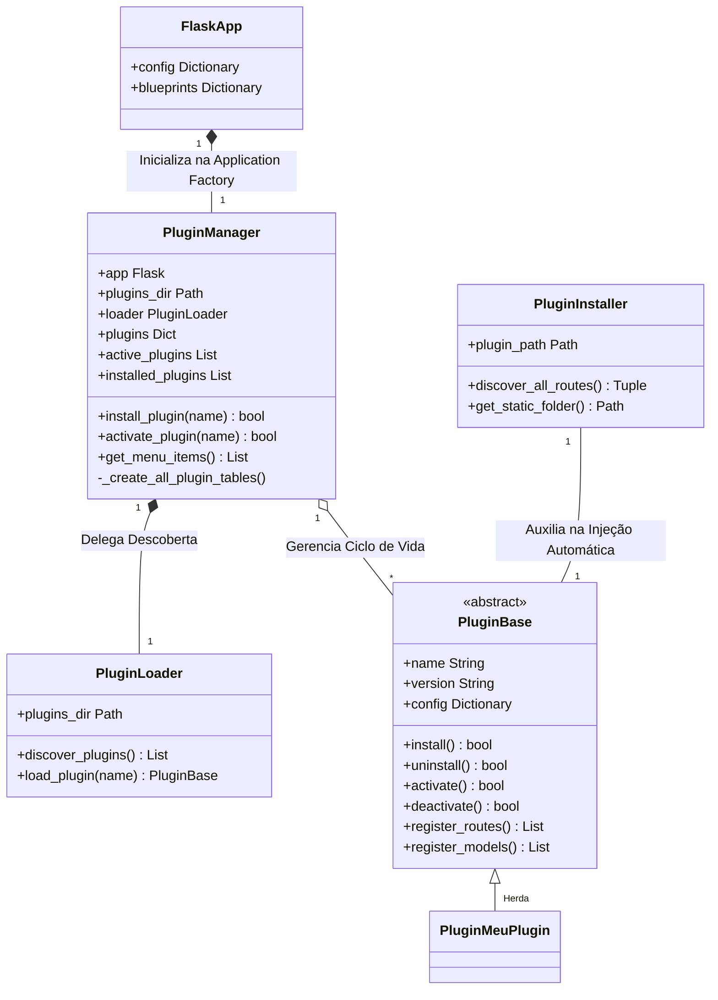
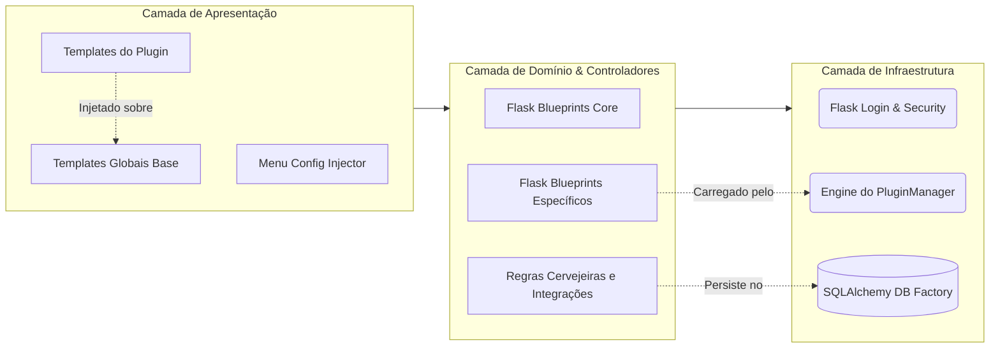

# 3. A Arquitetura do Core (Hub de Integração)

## O Propósito do Core

O **BrewStation** evoluiu de uma simples ferramenta de cálculo cervejeiro para um modelo de Estação de Trabalho (*Workstation*). O sistema "Core" (nucleico) do BrewStation atua estritamente como uma plataforma de infraestrutura independente, análoga a um pequeno Sistema Operacional web, enquanto a inteligência e o domínio de negócios vivem inteiramente isolados em "Apps" acopláveis chamados de Plugins.

## Estrutura de Classes Principais do Core

Abaixo ilustramos as peças estáticas essenciais (Classes do Python) que dão vida a Arquitetura da Estação.

## Separação em Camadas e o Encaixe dos Plugins

O ecossistema é estritamente separado em Camadas Lógicas para evitar espaguete de código.

## Como a Plataforma Inicia (O Workflow do Application Factory)

A rotina em `src/main.py` levanta os pilares essenciais. O Flask orquestra e sobe os provedores necessários antes das rotas customizarem o comportamento:

1. **Environment Setup:** Definição de Secrets, Debug Flags, e pastas de static file globais.
2. **Database Factory:** Assinatura do `db.init_app`.
3. **Session & Auth Manager:** Definição do comportamento via `Flask-Login` garantindo que o Auth seja a única regra unânime.
4. **Boot do Gerenciador de Plugins:** A chamada central para instanciar o `PluginManager` que fará toda varredura, validação de JSON e `PluginLoader`.
5. **Comandos de Terminal:** A `cli.py` atrela as referências.
