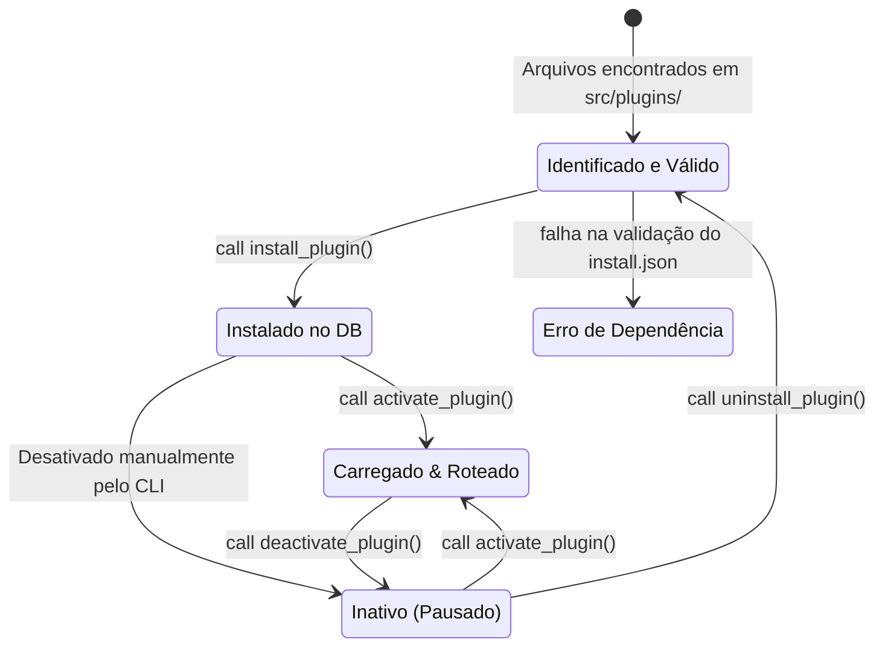
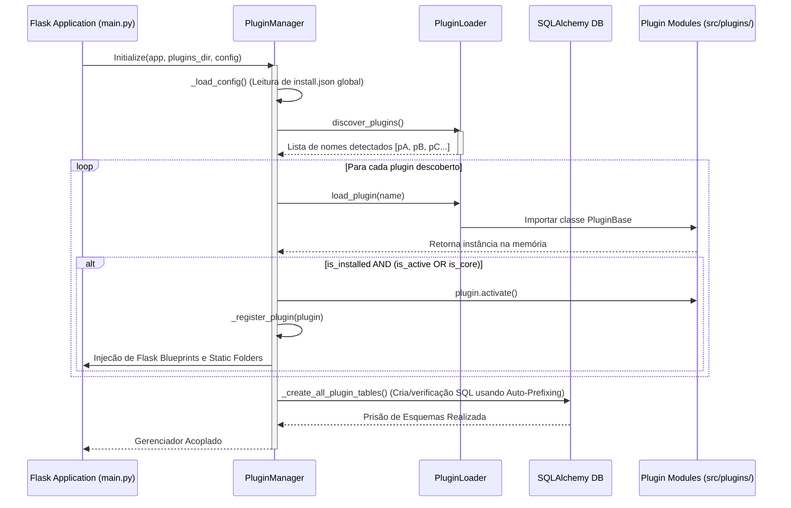
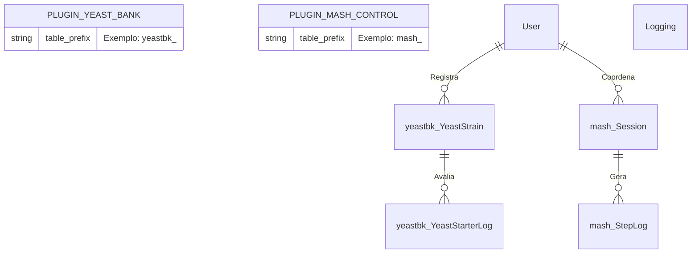

# 4. O Sistema de Plugins (Ciclo de Vida)

## Visão Geral do Ciclo

O coração expansível do BrewStation vive em `src/core/plugin_manager.py`. Ele aplica transições restritas no Ciclo de Vida de um plugin, onde um plugin deve existir (`Draft/Discovered`), ser testado/ativado (`Active`) ou falhar e desativar.

## Máquina de Estados e Ciclo de Vida do Plugin

Todo Plugin no ecossistema passa por uma rígida transição de estados antes de assumir papéis e injetar rotas HTTP no Flask:

## Fluxo de Carregamento na Inicialização da Estação

Ao iniciar a BrewStation (`python main.py`), este é o comportamento sequencial da Plataforma verificando suas extensões interconectadas:

## Fluxo de Mapeamento do Banco de Dados

O BrewStation evita confrontos de tabelas no banco de dados (`SQLite`/`PostgreSQL`) quando múltiplos plugins existem, utilizando o `Auto-Prefixing`.

Este mapa ER indica que mesmo o Módulo Core (Usuários) podendo relacionar-se com tabelas de plugins, essas tabelas carregam intrinsecamente um nome no banco (Ex: `yeastbk_`) que isola seus dados de corromper outros componentes, preservando independência em Drop/Upgrade/Downgrade de schema de banco.
