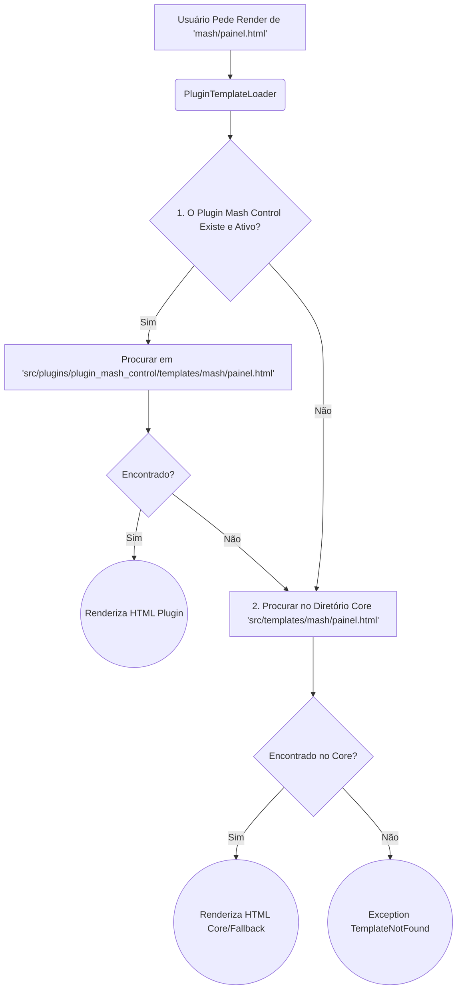

# 5. Gerenciamento de Menus e Views (Renderização do UI)

O painel administrativo do BrewStation não possui itens de navegação engessados. A apresentação visual evolui orgânica e dinamicamente conforme os Plugins acendem na ignição de sistema gerando os seus devidos manifestos via `menu_config.json`.

## O Fluxo Estrutural do Roteamento Web e Menu Dinâmico

Quando um desenvolvedor habilita um novo "App", a Plataforma varre seu Manifesto JSON extraindo metadados de Rotas e Classes Bootstrap (Ícones), repassando essas estruturas as instâncias globais via Context Processors do Jinja2.

```mermaid
flowchart TD
    subgraph UI Render [Interface do Usuário (SideBar)]
        direction TB
        BaseTemplate(Template base.html)
        MenuInjector[inject_plugin_menu Context Processor]
    end

    subgraph Plugins MenuConfigs [Manifestos na Camada de Plugins]
        M1{plugin_yeast_bank} -- "Lê menu_config.json" --> M1C(Array: main_items)
        M2{plugin_device_manager} -- "Lê menu_config.json" --> M2C(Array: main_items)
        MCore{plugin_integ_bFather} -- "Lê menu_config.json" --> MCoreC(Array: main_items)
    end

    M1C --> MenuInjector
    M2C --> MenuInjector
    MCoreC --> MenuInjector

    MenuInjector -- Injecao --> BaseTemplate
    
    subgraph Jinja2 Logic [Decisão de Renderização]
        BaseTemplate --> L1{Check Active Plugins}
        L1 -- Loop --> T1[Generate <li> com url_for(Endpoint)]
        T1 --> T2[Fallback para '#' se rota falhar]
    end
```

## Como o Sistema Escolhe os Templates HTML a Mostrar?

O mecanismo `PluginTemplateLoader` subverte o loader padrão do Flask (pasta global `templates/`). O Flask primeiro buscará no repositório de views os templates providos pelo próprio **Plugin Autor**.

### Modelo de "Precedência de Carregamento"

Esse fluxo indica onde a Estação tentará ler o seu arquivo `index.html`:



Essa herança prototipada de Views permite que:
1. Módulos tragam `HTML` estritamente contido no diretório daquele plugin.
2. Módulos "sobrescrevam" partes fundamentais do sistema global (como uma barra de dashboard), declarando nos seus diretórios um view que concorra com do namespace inicial global do sistema.
