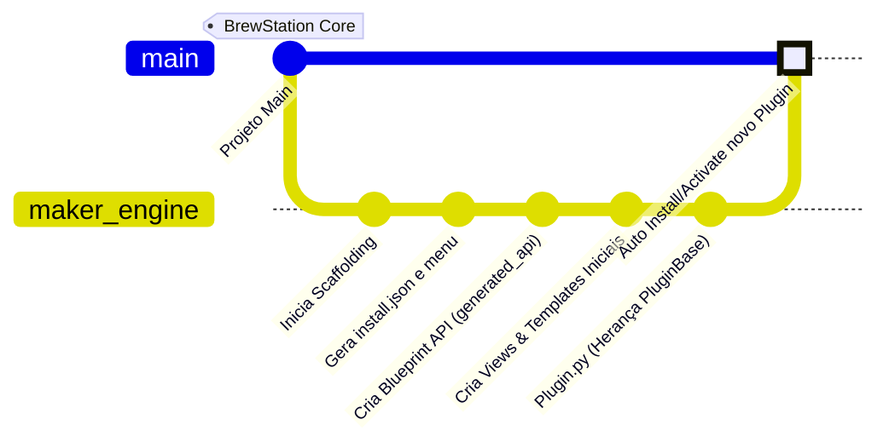
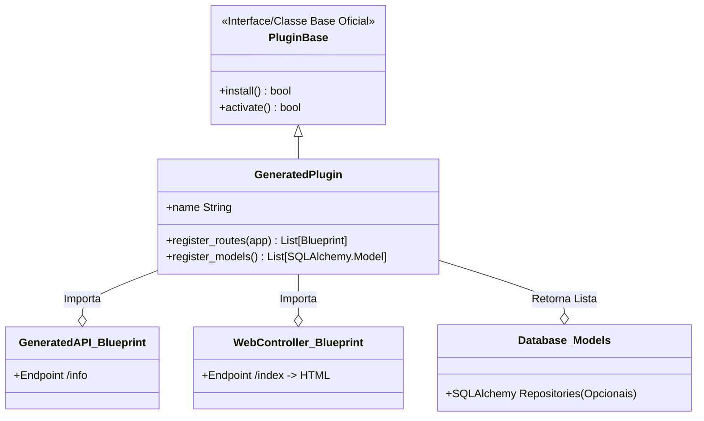

# 6. O Gerador "Maker" e Estrutura dos Plugins (Scaffolding Automático)

Nesta versão do BrewStation, a plataforma inclui nativamente um "Módulo Gerador" encarregado de construir e expandir extensões de forma autônoma: o `plugin_maker`.
Desenvolvedores de "Apps" cervejeiros não necessitam mais criar classes boilerplate.

## O Fluxo de Desenvolvimento Guiado (Scaffolding)

O Maker gera a estrutura da forma esperada pelo Core System:

## Dissecando o Artefato Gerado (A Anatomia Oficial de um Plugin)

Abaixo observamos a Classe/Interface UML gerada automaticamente na inicialização de qualquer "App" da plataforma BrewStation pelo comando Reconstrutor de API (`/api/maker/rebuild`):

Na rota final (Aplicar Rebuild), o Maker efetivamente grava a árvore de código estrita (Standard MVC):
1. Diretório raiz: `src/plugins/plugin_[seu_nome]`
2. Esconde o artefato original gerador em: `.maker/manifest.json`.
3. Escreve os descritores básicos (`install.json`, `menu_config.json`, `plugin.py`).
4. Fabrica os diretórios auxiliares padronizados: 
   - `model/` (Mapeamento de banco de dados).
   - `utils/` (Helpers e injeção).
   - `docs/` (Para documentação Markdown do Módulo).
   - `logs/` (Ambiente local para troubleshooting isolado do seu App).
