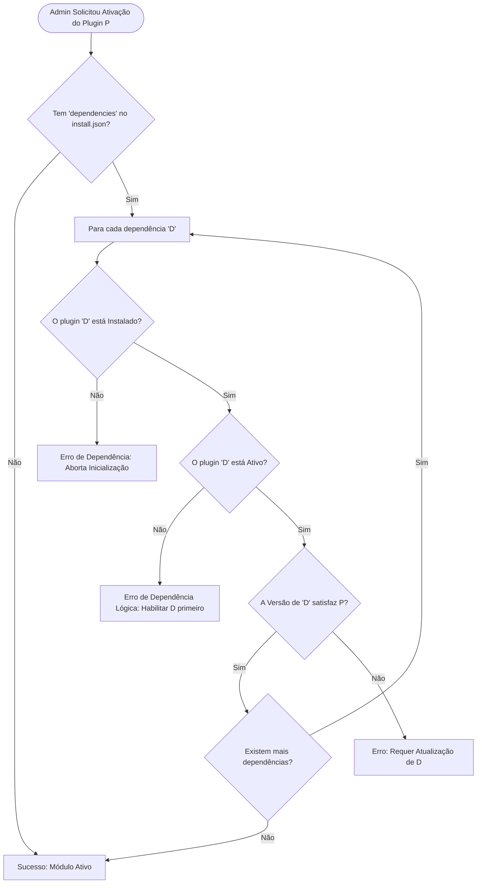
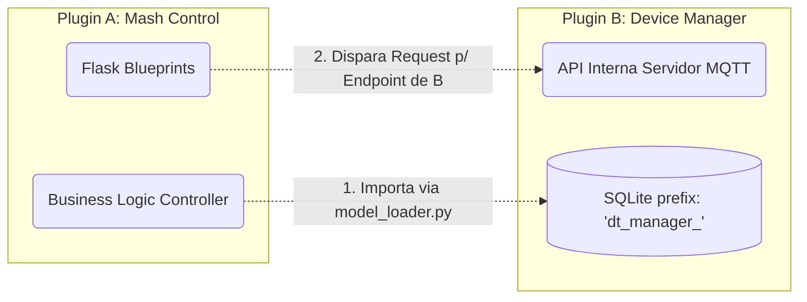

# 7. Comunicação Cíclica (Dependências Inter-Plugin)

Assim como em sistemas maduros (e.g., WordPress, HomeAssistant), a nova versão da Plataforma BrewStation implementa o conceito de resoluções de dependências estruturais entre os "Apps".

Por exemplo: O "Mash Control" (Controle de Brassagem Rápida) precisa se comunicar com Atuadores/Sensores (Termômetros, Relés). Em vez de implementar a complexidade IoT do zero, o `install.json` do `plugin_mash_control` declarará dependência direta do `device_manager`.

## Resolução Formal e Proteções do Sistema

Quando o desenvolvedor (ou `Admin`) requisita a inicialização de um pacote, o `PluginManager._check_dependencies(plugin)` avalia uma lista cruzada do que o novo pacote quer e o que o hub está orquestrando.

## Como a Integração entre Plugins Funciona no Python

No ecossistema atual, o Flask atua como o mediador (`event bus`):
A comunicação *intra-plugin* (Python p/ Python) não ocorre de forma fracamente tipada. O ideal do sistema é exportar Classes/Modelos, acessados via `model_loader` do Plugin B dentro do escopo do Plugin A.

Isso garante duas frentes oficiais para "Programação Orientada a Módulos" na **BrewStation Platform v2.0**:
1. Chamadas de REST Enfileiradas Localmente (onde A chama o EndPoint Web de B).
2. Agenciamento do Database via Import do Repositório do vizinho. 
