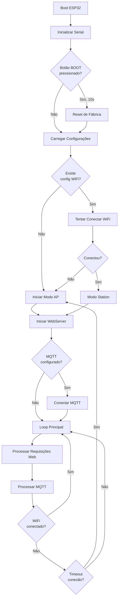

# Fluxo de Funcionamento

## Diagrama de Fluxo Principal



## Fluxo Detalhado

### 1. Inicialização (setup)

```
1. Serial.begin(115200)
   └─> Configura comunicação serial para debug

2. Verificar Reset de Fábrica
   ├─> Ler GPIO 0 (BOOT button)
   ├─> Se pressionado por 10s:
   │   └─> configManager.resetAll()
   └─> Continuar inicialização

3. ConfigManager.begin()
   └─> Abre Preferences namespace "brewstation"

4. WiFiManager.begin()
   └─> WiFi.mode(WIFI_AP_STA)

5. Carregar Configuração WiFi
   ├─> configManager.loadWiFiConfig()
   ├─> Se existe:
   │   ├─> wifiManager.connectToWiFi()
   │   ├─> Timeout: 30 segundos
   │   ├─> Sucesso:
   │   │   ├─> statusLED.setConnected()
   │   │   └─> wifiManager.stopAP()
   │   └─> Falha:
   │       ├─> statusLED.setAPMode()
   │       └─> wifiManager.startAP()
   └─> Se não existe:
       ├─> statusLED.setAPMode()
       └─> wifiManager.startAP()

6. WebServer.begin()
   ├─> SPIFFS.begin()
   ├─> Configurar rotas
   └─> server.begin()

7. MQTT (se configurado)
   ├─> configManager.hasMQTTConfig()
   ├─> Se sim:
   │   ├─> mqttClient.begin()
   │   ├─> Se WiFi conectado:
   │   │   └─> mqttClient.connect()
   │   └─> Se não conectado:
   │       └─> Aguardar conexão WiFi
   └─> Se não:
       └─> Pular inicialização MQTT
```

### 2. Loop Principal

```
Repetir infinitamente:

1. statusLED.update()
   └─> Atualiza estado do LED baseado no modo

2. wifiManager.update()
   ├─> Verificar se não está em AP e não conectado
   ├─> Se shouldFallbackToAP():
   │   └─> handleFallback()
   └─> Verificação periódica a cada 10s

3. Atualizar LED baseado em estado WiFi
   ├─> Se isAPMode():
   │   └─> statusLED.setAPMode()
   ├─> Se isConnected():
   │   ├─> statusLED.setConnected()
   │   └─> Tentar conectar MQTT se não conectado
   └─> Caso contrário:
       └─> statusLED.setConnecting()

4. webServer.handleClient()
   └─> Processa requisições HTTP pendentes

5. mqttClient.loop()
   ├─> Se conectado:
   │   ├─> Processa mensagens recebidas
   │   └─> Mantém conexão ativa
   └─> Se não conectado:
       └─> Tentar reconectar a cada 5s

6. delay(10)
   └─> Pequeno delay para evitar sobrecarga
```

### 3. Fluxo de Configuração WiFi

```
1. Cliente conecta à rede "ND_BrewStation"
   └─> IP: 192.168.4.1

2. Cliente acessa http://192.168.4.1
   ├─> GET /
   └─> webServer.handleRoot()
       ├─> Tenta servir /index.html do SPIFFS
       └─> Se não encontrar, serve HTML inline

3. Cliente preenche formulário
   ├─> SSID
   ├─> Senha
   ├─> IP Estático (opcional)
   ├─> MQTT (opcional)
   └─> Clica "Salvar"

4. POST /config
   ├─> webServer.handleConfig()
   ├─> Parsing dos dados do formulário
   ├─> Criar WiFiConfig
   ├─> Criar MQTTConfig (se habilitado)
   ├─> configManager.saveWiFiConfig()
   ├─> configManager.saveMQTTConfig() (se habilitado)
   ├─> Responder JSON de sucesso
   └─> ESP.restart()

5. Após reinício
   ├─> Carregar configurações salvas
   ├─> Tentar conectar WiFi
   └─> Conectar MQTT (se configurado)
```

### 4. Fluxo de Fallback

```
Condição: WiFi desconectado e não em modo AP

1. wifiManager.update() detecta desconexão
   └─> shouldFallbackToAP() retorna true

2. handleFallback()
   ├─> WiFi.disconnect()
   ├─> delay(500)
   └─> startAP()

3. Status LED muda
   └─> statusLED.setAPMode()

4. Servidor web continua ativo
   └─> Cliente pode reconfigurar

5. Loop continua normalmente
   └─> Aguardando nova configuração ou reconexão
```

### 5. Fluxo MQTT

#### Conexão Inicial

```
1. mqttClient.begin()
   ├─> Carregar MQTTConfig
   ├─> mqttClient.setServer(host, port)
   └─> mqttClient.setCallback()

2. mqttClient.connect()
   ├─> Verificar WiFi conectado
   ├─> Criar clientId (deviceId)
   ├─> Criar willTopic (status/offline)
   ├─> Tentar conectar
   │   ├─> Com autenticação (se configurado)
   │   └─> Sem autenticação
   └─> Se sucesso:
       └─> publishStatus("online")

3. Loop MQTT
   └─> mqttClient.loop()
       ├─> Processa mensagens recebidas
       └─> Mantém conexão ativa
```

#### Reconexão

```
1. mqttClient.loop() detecta desconexão
   └─> !mqttClient.connected()

2. Verificar intervalo de reconexão (5s)
   └─> lastReconnectAttempt

3. reconnect()
   ├─> Verificar WiFi conectado
   ├─> Tentar conectar novamente
   └─> Se sucesso:
       └─> publishStatus("online")
```

#### Publicação

```
1. Aplicação chama publishSensor()/publishActuatorState()
   ├─> Verificar isConnected()
   ├─> Construir tópico
   └─> mqttClient.publish()

2. Mensagem publicada
   └─> Broker recebe e distribui
```

#### Recebimento

```
1. Broker envia mensagem
   └─> Tópico subscrito

2. mqttCallback() chamado
   ├─> Parse tópico
   ├─> Identificar tipo (sensor/actuator)
   ├─> Se actuator/set:
   │   ├─> Extrair porta
   │   ├─> Extrair valor
   │   └─> Chamar actuatorCallback()
   └─> Log da mensagem
```

### 6. Fluxo de Reset

```
1. Cliente acessa GET /reset
   └─> webServer.handleReset()

2. configManager.resetAll()
   └─> preferences.clear()

3. Responder JSON
   └─> {"success": true, "message": "..."}

4. delay(1000)
   └─> Permitir resposta ser enviada

5. ESP.restart()
   └─> Reinício completo

6. Após reinício
   ├─> Nenhuma configuração encontrada
   ├─> Iniciar modo AP
   └─> Aguardar nova configuração
```

## Estados do Sistema

### Estado: Modo AP

- WiFi em modo AP
- Rede "ND_BrewStation" ativa
- IP: 192.168.4.1
- WebServer ativo
- LED piscando rápido
- MQTT não conectado

### Estado: Conectando

- Tentando conectar WiFi
- Timeout: 30 segundos
- LED piscando lento
- WebServer ativo (se em modo AP)
- MQTT não conectado

### Estado: Conectado

- WiFi conectado
- IP obtido (DHCP ou estático)
- WebServer ativo
- LED fixo ligado
- MQTT conectado (se configurado)

### Estado: Fallback

- WiFi desconectado
- Transição para modo AP
- LED muda para piscando rápido
- WebServer continua ativo
- MQTT desconectado

## Timeouts e Intervalos

- **Timeout de conexão WiFi**: 30 segundos
- **Intervalo de verificação de status**: 10 segundos
- **Intervalo de reconexão MQTT**: 5 segundos
- **Keep-alive MQTT**: 60 segundos
- **Delay no loop principal**: 10ms
- **Reset de fábrica**: 10 segundos
